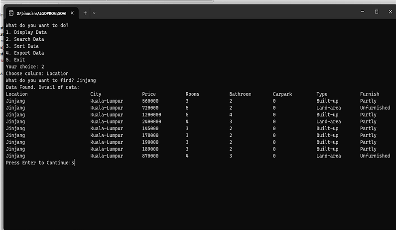
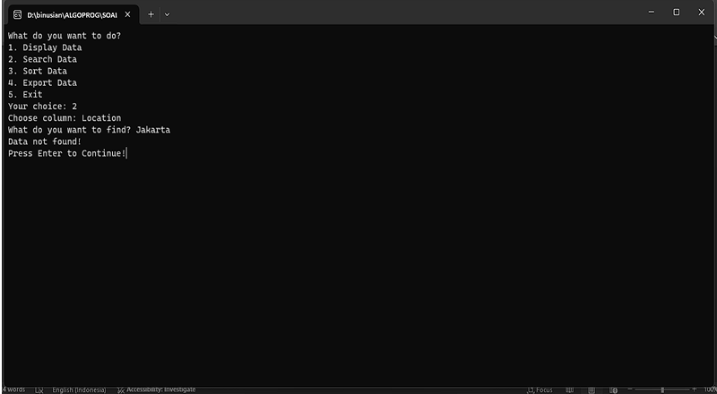

# 📘 Algorithm & Programming Project

This repository contains the **Algorithm & Programming** project for the course assignment.  
It demonstrates the implementation of basic programming concepts including string manipulation, menu-driven programs, searching, sorting, and file export.

---

## 👨‍💻 Author
- **Name:** Ignatius Abraham Aristio Kusnadi  
- **NIM:** 2702243590  

---

## 📌 Cases

### 1. Reverse String & Reverse Capslock
- Function to reverse a string.  
- Reverse **capslock** (uppercase to lowercase and lowerdase to uppercase).  

📷 **Screenshot:**  

---

### 2. Menu Driven Program
Provides a console-based interactive menu with the following functions:

#### a. Display Data
- Displays stored data in a structured table format.  
- User can choose **how many rows of data** to display (e.g., first 5, 10, or all data).  

📷 **Screenshot:**  

---

#### b. Search Data
- Allows searching for a specific data entry.  
- Handles both cases: **Found** and **Not Found**.  

📷 **Screenshots:**  
- When data is **Found**:  
    

- When data is **Not Found**:  
    

---

#### c. Sorting Data
- Allows sorting of data based on selected columns (e.g., `Rooms`, `Price`, etc.).  
- User can choose **ascending** or **descending** order.  
- Displays the sorted dataset in a tabular format.  

📷 **Screenshot:**  

---

#### d. Export Data
- Exports the dataset into a **CSV file**.  

📷 **Screenshot:**  

---

#### d. Export Result
- Allows the exported data to be opened and analyzed in external tools such as Excel.  

📷 **Screenshot:**  

---

## 📝 Notes
- Developed as part of the **AOL (Algorithm & Programming)** coursework.  
- Focus on mastering **basic programming structures** (loops, conditions, functions).  
