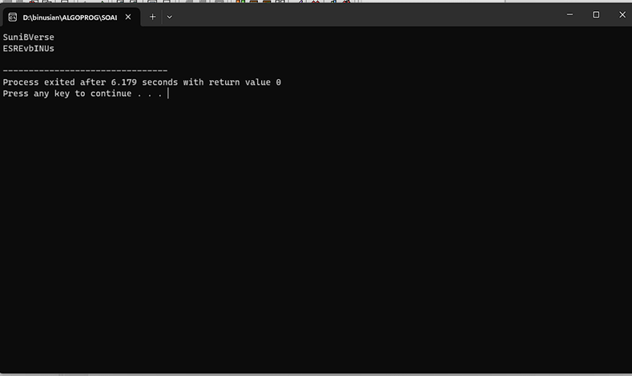
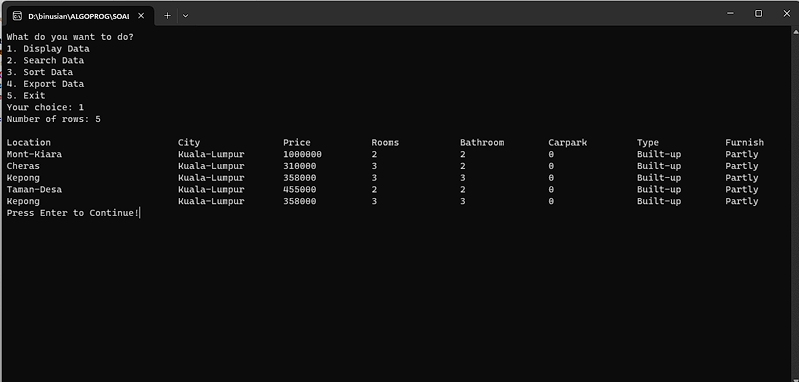
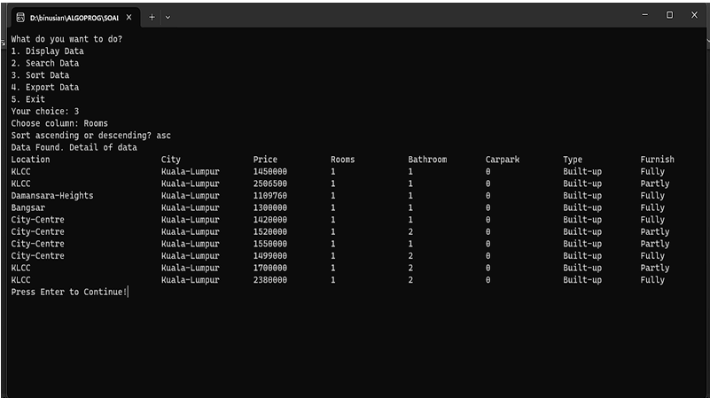
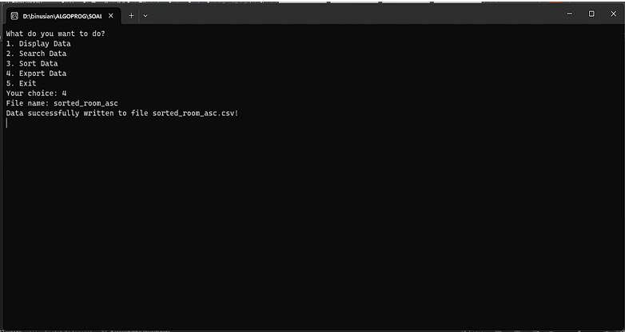
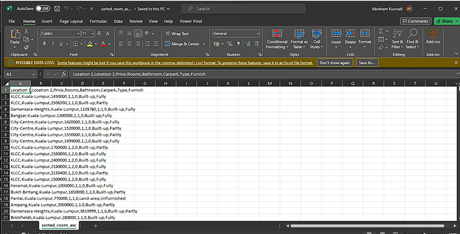

# 📘 Algorithm & Programming (AOL) Project

This repository contains the **Algorithm & Programming (AOL)** project for the course assignment.  
It demonstrates the implementation of basic programming concepts including string manipulation, menu-driven programs, searching, sorting, and file export.

---

## 👨‍💻 Author
- **Name:** Ignatius Abraham Aristio Kusnadi  
- **NIM:** 2702243590  

---

## 📌 Cases

### 1. Reverse String & Reverse Capslock
- Function to reverse a string.  
- Option to reverse **capslock** (uppercase to lowercase and vice versa).  

📷 **Screenshot:**  

---

### 2. Menu Driven Program
Provides a console-based interactive menu with the following functions:

#### a. Display Data
- Displays stored data in a structured format.  

📷 **Screenshot:**  

---

#### b. Search Data
- Allows searching for a specific data entry.  
- Handles both **Found** and **Not Found** cases.  

📷 **Screenshot:**  

---

#### c. Sorting Data
- Sorts the available data for easier lookup and analysis.  

📷 **Screenshot:**  

---

#### d. Export Data
- Exports the dataset to an external file for persistence.  

📷 **Screenshot:**  

---

## 📊 Export Result
- Data is successfully exported and can be viewed outside the program.  

📷 **Screenshot:**  

---

## 📝 Notes
- Developed as part of the **AOL (Algorithm & Programming)** coursework.  
- Focus on mastering **basic programming structures** (loops, conditions, functions).  
